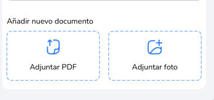
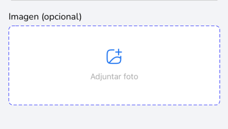
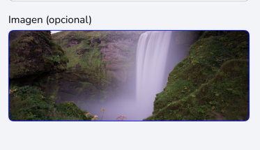
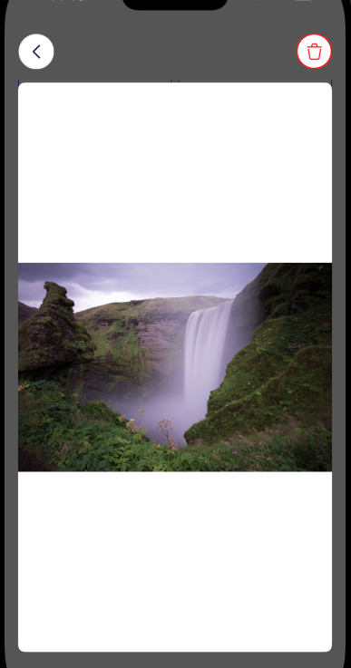

# DHLCustomUploadPhotoView

Custom views to upload and view photos and PDFs.


## Preview








## Installation

### CocoaPods

```ruby
pod 'DHLCustomUploadPhotoView'
```

## Quick Start

### UIKit

```swift
let documentViewerView = DHLDocumentViewerView(frame: .zero)
documentViewerView.translatesAutoresizingMaskIntoConstraints = false

self.window?.addSubview(documentViewerView)

    
NSLayoutConstraint.activate([
    documentViewerView.topAnchor.constraint(equalTo: view.topAnchor),
    documentViewerView.bottomAnchor.constraint(equalTo: view.bottomAnchor),
    documentViewerView.leadingAnchor.constraint(equalTo: view.leadingAnchor),
    documentViewerView.trailingAnchor.constraint(equalTo: view.trailingAnchor)
])

documentViewerView.setUp(
    parent: self.parentViewController,
    title: self.especie?.getNombre(),
    document: data,
    showDelete: false,
    showDownloadButton: false,
    allowZoom: true,
    deleteAction: {},
    cancelAction: {
        documentViewerView.removeFromSuperview()
    }
)
```
